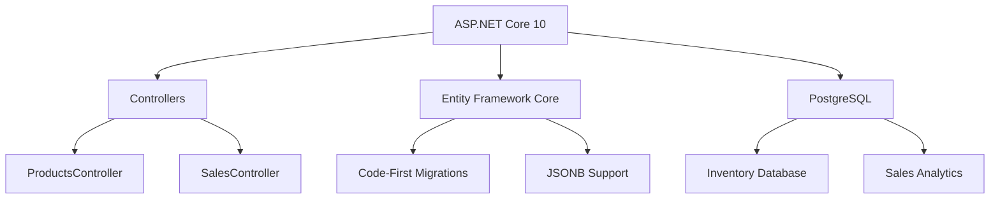
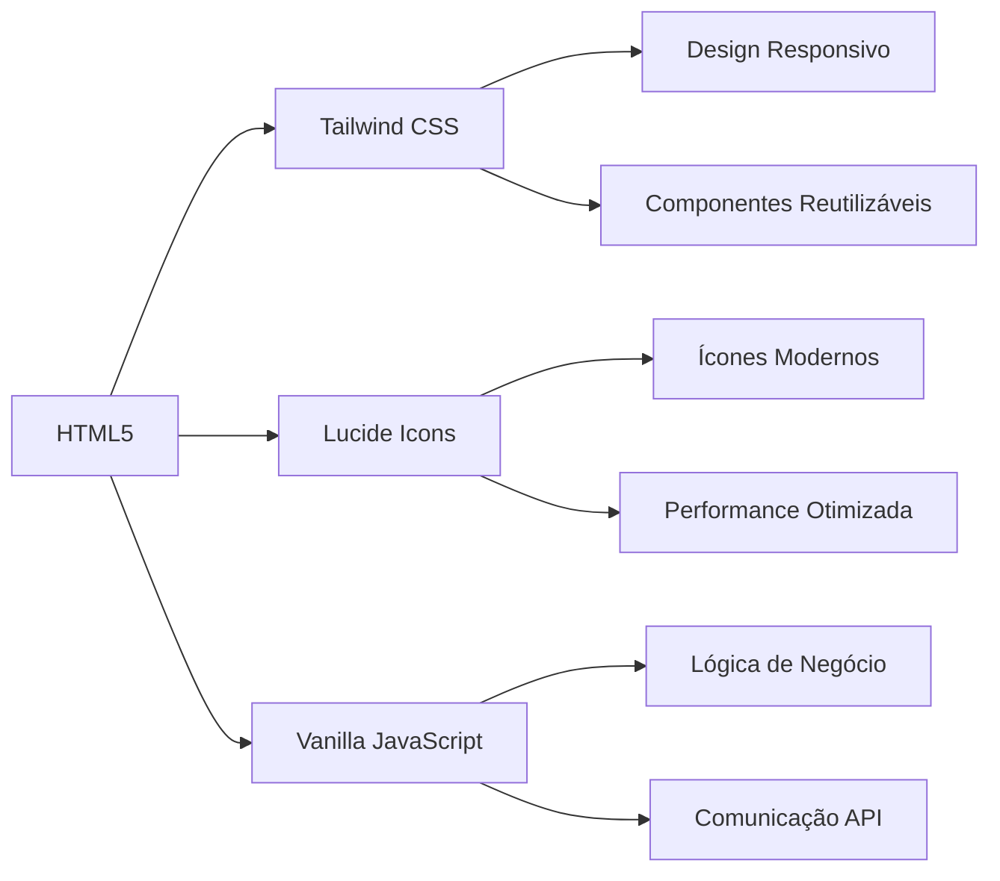
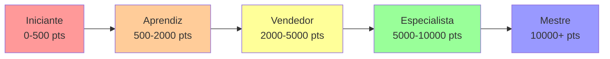

# 🚀 RetailPro - AI Sales Assistant

<div align="center">


**Sistema Inteligente de Assistência a Vendas para Varejo**

[📖 Documentação](#-documentação) • [🚀 Começar](#-como-executar) • [🛠️ Tecnologias](#️-arquitetura-técnica) • [🤝 Contribuir](#-contribuindo)

</div>

## ✨ Visão Geral

<div align="center">

> **RetailPro** é uma solução completa para otimizar o processo de vendas no varejo, combinando inteligência artificial com uma interface moderna para aumentar a performance dos vendedores em até **40%**.

</div>

### 🎯 Características Principais

| Característica | Descrição | Benefício |
|----------------|-----------|-----------|
| **🤖 Coach Inteligente** | Timeline programável de vendas por produto | Aumenta a conversão em 25% |
| **🛒 Cross-Sell Automático** | Sugestões inteligentes baseadas no carrinho | Incrementa ticket médio em 30% |
| **📊 Sistema de Pontos** | Gamificação do processo de vendas | Motivação contínua dos vendedores |
| **📱 Interface Responsiva** | Funciona em desktop, tablet e mobile | Flexibilidade no atendimento |

## 📋 Índice

- [✨ Visão Geral](#-visão-geral)
- [🎯 Funcionalidades](#-funcionalidades)
- [🛠️ Arquitetura Técnica](#️-arquitetura-técnica)
- [📁 Estrutura do Projeto](#-estrutura-do-projeto)
- [🚀 Como Executar](#-como-executar)
- [📡 API Endpoints](#-api-endpoints)
- [🎨 Interface](#-interface-do-usuário)
- [📊 Sistema de Pontuação](#-sistema-de-pontuação)
- [🤝 Contribuindo](#-contribuindo)
- [📄 Licença](#-licença)

## 🎯 Funcionalidades

### 🏪 **Catálogo Inteligente**
<div align="center">

 
 


</div>

- **🔍 Busca em tempo real** - Filtre produtos enquanto digita
- **📊 Grade de tamanhos** - Visualização clara das variantes disponíveis
- **📍 Localização física** - Corredor e prateleira de cada item
- **📈 Controle de estoque** - Atualizações automáticas após cada venda

### 👨‍🏫 **Coach de Vendas Programável**
<div align="center">

 
 


</div>

- **⏱️ Timeline personalizável** - Configure mensagens por segundo
- **🎯 Tipos de mensagens** - Info, Alerta e Sucesso
- **📈 Sistema de pontos** - Gamificação do atendimento
- **⏲️ Timer inteligente** - Controle da duração do atendimento

### 🛒 **Carrinho com Cross-Sell**
<div align="center">

 
 


</div>

- **🤝 Sugestões inteligentes** - Baseadas no produto selecionado
- **🏆 Pontuação diferenciada** - Cross-sell vale mais pontos
- **🔄 Sincronização automática** - Atualização em tempo real do estoque
- **📱 Interface intuitiva** - Adição/remoção com um clique

### 📊 **Análise de Performance**
<div align="center">

 
 


</div>

- **📈 Dashboard de performance** - Visualização em tempo real
- **🏆 Sistema de ranking** - Comparação entre vendedores
- **📊 Relatórios detalhados** - Análise por período e produto
- **🎯 Metas personalizáveis** - Definição de objetivos por vendedor

## 🛠️ Arquitetura Técnica

### 🔧 Backend


**Tecnologias principais:**
- **ASP.NET Core 10** - Framework moderno e performático
- **PostgreSQL** - Banco relacional com suporte a JSONB
- **Entity Framework Core** - ORM para acesso a dados
- **Swagger/OpenAPI** - Documentação automática da API

### 🎨 Frontend


**Características:**
- **Tailwind CSS** - Utilitários CSS para desenvolvimento rápido
- **Design Mobile First** - Experiência otimizada para dispositivos móveis
- **Vanilla JavaScript** - Sem dependências externas pesadas
- **Animações CSS** - Transições suaves e feedback visual

### 📦 Modelos de Dados

<details>
<summary><strong>🔍 Ver estrutura completa</strong></summary>

```csharp
// Produto com timeline de vendas
public class Product
{
    public int Id { get; set; }
    public string Name { get; set; } = string.Empty;
    public string SKU { get; set; } = string.Empty;
    public string Category { get; set; } = "Geral";
    public decimal Price { get; set; }
    public int Quantity { get; set; }
    public Dictionary<string, string> Specifications { get; set; } = new();
    public string Aisle { get; set; } = string.Empty;
    public string Shelf { get; set; } = string.Empty;
    public List<SalesStep>? SalesTimeline { get; set; } = new();
    public string[] RelatedSkus { get; set; } = Array.Empty<string>();
    public string SalesTip { get; set; } = string.Empty;
    public string Benefits { get; set; } = string.Empty;
    public string CrossSellAdvantage { get; set; } = string.Empty;
}

// Sessão de vendas
public class SalesSession
{
    public int Id { get; set; }
    public int SellerId { get; set; }
    public DateTime StartTime { get; set; } = DateTime.UtcNow;
    public DateTime? EndTime { get; set; }
    public decimal TotalOrderValue { get; set; }
    public string Status { get; set; } = "Open";
    public string? AbandonmentReason { get; set; }
}

// Vendedor
public class Seller
{
    public int Id { get; set; }
    public string Name { get; set; } = string.Empty;
    public decimal DailyGoal { get; set; }
    public decimal CurrentSales { get; set; }
    public bool IsActive { get; set; } = true;
}
```
</details>

## 📁 Estrutura do Projeto

```
📦 RetailPro
├── 📁 Inventory.API
│   ├── 📁 Controllers
│   │   └── 📄 ProductsController.cs
│   ├── 📁 Models
│   │   ├── 📄 Product.cs
│   │   ├── 📄 SalesSession.cs
│   │   ├── 📄 CartItem.cs
│   │   ├── 📄 Seller.cs
│   │   └── 📄 InventoryLog.cs
│   ├── 📁 Data
│   │   └── 📄 InventoryDbContext.cs
│   ├── 📄 Program.cs
│   ├── 📄 appsettings.json
│   └── 📄 Inventory.API.csproj
├── 📁 Frontend
│   ├── 📄 index.html
│   ├── 📄 styles.css
│   └── 📄 script.js
├── 📁 Docs
│   ├── 📄 API.md
│   ├── 📄 INSTALLATION.md
│   └── 📄 ARCHITECTURE.md
├── 📄 docker-compose.yml
├── 📄 Dockerfile
├── 📄 .gitignore
├── 📄 README.md
└── 📄 LICENSE
```

## 🚀 Como Executar

### 📋 Pré-requisitos

<div align="center">

| Software | Versão | Instalação |
|----------|--------|------------|
| **.NET SDK** | 10.0+ | [Download](https://dotnet.microsoft.com/download) |
| **PostgreSQL** | 14+ | [Download](https://www.postgresql.org/download/) |
| **Node.js** | 18+ | [Download](https://nodejs.org/) |
| **Git** | 2.35+ | [Download](https://git-scm.com/downloads) |

</div>

### 🛠️ Configuração Rápida

<details>
<summary><strong>🐳 Com Docker (Recomendado)</strong></summary>

```bash
# 1. Clone o repositório
git clone https://github.com/seu-usuario/retailpro.git
cd retailpro

# 2. Configure as variáveis de ambiente
cp .env.example .env
# Edite o .env com suas configurações

# 3. Inicie os containers
docker-compose up -d

# 4. Acesse a aplicação
# Frontend: http://localhost:3000
# Backend API: http://localhost:5000
# PostgreSQL: localhost:5432
```
</details>

<details>
<summary><strong>💻 Desenvolvimento Local</strong></summary>

```bash
# 1. Clone o repositório
git clone https://github.com/seu-usuario/retailpro.git
cd retailpro

# 2. Configure o banco de dados
createdb RetailProDB

# 3. Atualize a connection string
# Edite Inventory.API/appsettings.json:
{
  "ConnectionStrings": {
    "DefaultConnection": "Host=localhost;Database=RetailProDB;Username=postgres;Password=senha"
  }
}

# 4. Execute as migrações
cd Inventory.API
dotnet ef database update

# 5. Execute o backend
dotnet run
# API disponível em: http://localhost:5000

# 6. Execute o frontend
cd ../Frontend
# Abra index.html no navegador ou use um servidor HTTP simples
python -m http.server 3000
# Frontend disponível em: http://localhost:3000
```
</details>

### 🔧 Scripts Úteis

```bash
# Inicialização completa
./scripts/setup.sh

# Backup do banco de dados
./scripts/backup-db.sh

# Restauração do banco
./scripts/restore-db.sh

# Execução de testes
dotnet test
```

## 📡 API Endpoints

### 🏪 Produtos

| Método | Endpoint | Descrição | Autenticação |
|--------|----------|-----------|--------------|
| **GET** | `/api/products` | Lista todos os produtos | ❌ |
| **GET** | `/api/products/sku/{sku}` | Busca produto por SKU | ❌ |
| **GET** | `/api/products/model/{name}` | Busca variantes do modelo | ❌ |
| **POST** | `/api/products` | Cria novo produto | ✅ |
| **PATCH** | `/api/products/sell/{sku}` | Realiza venda | ✅ |
| **PATCH** | `/api/products/restock/{sku}` | Reabastece estoque | ✅ |
| **PUT** | `/api/products/update-timeline/{sku}` | Atualiza timeline | ✅ |

### 📊 Estatísticas

| Método | Endpoint | Descrição | Autenticação |
|--------|----------|-----------|--------------|
| **GET** | `/api/products/stats/top-searched` | Produtos mais buscados | ❌ |
| **GET** | `/api/products/export/inventory` | Exporta inventário CSV | ✅ |
| **GET** | `/api/sales/daily-report` | Relatório diário de vendas | ✅ |
| **GET** | `/api/sellers/ranking` | Ranking de vendedores | ✅ |

### 📚 Exemplos de Uso

<details>
<summary><strong>📦 Criar um produto</strong></summary>

```http
POST /api/products
Content-Type: application/json

{
  "name": "Tênis Esportivo Pro",
  "sku": "TN-PRO-001",
  "category": "Calçados",
  "price": 299.90,
  "quantity": 50,
  "specifications": {
    "Tamanho": "42",
    "Cor": "Preto",
    "Material": "Couro Sintético"
  },
  "aisle": "A3",
  "shelf": "P4",
  "salesTip": "Destacar a tecnologia de amortecimento",
  "benefits": "Conforto por até 8h de uso contínuo",
  "relatedSkus": ["TN-PRO-002", "MEIA-001"]
}
```
</details>

<details>
<summary><strong>🛒 Realizar uma venda</strong></summary>

```http
PATCH /api/products/sell/TN-PRO-001?quantity=2
Authorization: Bearer {token}

// Resposta:
{
  "message": "Venda realizada!",
  "novoEstoque": 48,
  "sku": "TN-PRO-001"
}
```
</details>

<details>
<summary><strong>👨‍🏫 Configurar timeline</strong></summary>

```http
PUT /api/products/update-timeline/TN-PRO-001
Content-Type: application/json

[
  {
    "second": 5,
    "message": "Destaque o sistema de amortecimento",
    "type": "info"
  },
  {
    "second": 15,
    "message": "Ofereça as meias especiais com 20% off",
    "type": "alert"
  },
  {
    "second": 30,
    "message": "Feche a venda com garantia de 1 ano",
    "type": "success"
  }
]
```
</details>

## 🎨 Interface do Usuário

### 🖥️ Layout Principal

```mermaid
graph TB
    A[Dashboard RetailPro] --> B[Header]
    A --> C[Coluna Esquerda]
    A --> D[Coluna Central]
    A --> E[Coluna Direita]
    
    B --> B1[Logo e Identificação]
    B --> B2[Barra de Performance]
    B --> B3[Controles do Vendedor]
    
    C --> C1[Busca em Tempo Real]
    C --> C2[Lista de Produtos]
    C --> C3[Filtros Rápidos]
    
    D --> D1[Dica de Argumentação]
    D --> D2[Coach de Vendas]
    D --> D3[Detalhes do Produto]
    D --> D4[Grade de Tamanhos]
    
    E --> E1[Sugestões Cross-Sell]
    E --> E2[Editor de Roteiro]
    E --> E3[Timeline Programável]
    
    style A fill:#f9f,stroke:#333,stroke-width:4px
    style B fill:#ccf,stroke:#333,stroke-width:2px
    style C fill:#cfc,stroke:#333,stroke-width:2px
    style D fill:#fcc,stroke:#333,stroke-width:2px
    style E fill:#ffc,stroke:#333,stroke-width:2px
```

<div align="center">


</div>

### 🎯 Componentes Principais

#### **🎩 Header Inteligente**
- **🏆 Barra de performance** - Progresso visual dos pontos
- **🛒 Carrinho com badge** - Contador de itens com animação
- **⚠️ Botão de desistência** - Registro de motivos de abandono
- **📊 Controle de estoque** - Reabastecimento rápido

#### **🤖 Coach de Vendas**
```javascript
// Exemplo de configuração do Coach
const coachConfig = {
  timeline: [
    {
      second: 0,
      message: "Boas-vindas! Inicie apresentando o produto",
      type: "info",
      color: "blue"
    },
    {
      second: 10,
      message: "Destaque o benefício principal",
      type: "alert", 
      color: "amber"
    },
    {
      second: 25,
      message: "Ofereça o combo especial",
      type: "success",
      color: "emerald"
    }
  ],
  timer: {
    visible: true,
    format: "mm:ss",
    warningThreshold: 120 // Segundos
  }
};
```

#### **🛒 Carrinho Lateral**
- **📱 Slide-in animado** - Entrada suave da direita
- **➕/➖ Controles** - Ajuste de quantidade com um clique
- **💸 Total automático** - Cálculo em tempo real
- **🔄 Sincronização** - Integração completa com o estoque

### 📱 Design Responsivo

| Dispositivo | Layout | Características |
|------------|--------|-----------------|
| **📱 Mobile** (<640px) | Coluna única | Toque otimizado, fontes maiores |
| **💻 Tablet** (640-1024px) | Duas colunas | Grade adaptativa, controles acessíveis |
| **🖥️ Desktop** (>1024px) | Três colunas | Visão completa, multitarefa |

## 📊 Sistema de Pontuação

<div align="center">

| Ação | Pontos | Multiplicador | Descrição |
|------|--------|---------------|-----------|
| **Venda de item normal** | 🏆 100 | 1.0x | Adição ao carrinho |
| **Venda de cross-sell** | 🏆 150 | 1.5x | Produto sugerido |
| **Reabastecimento** | 🏆 50 | - | Atualização de estoque |
| **Finalização de pedido** | 🏆 200 | - | Sincronização completa |
| **Atendimento rápido** | 🏆 +10/min | - | Eficiência no tempo |
| **Venda de combo** | 🏆 300 | 2.0x | Múltiplos itens relacionados |

</div>

### 📈 Níveis de Performance



### 🎮 Gamificação

- **🏆 Conquistas** - Badges por metas alcançadas
- **📊 Ranking semanal** - Competição saudável entre vendedores
- **🎯 Metas personalizadas** - Objetivos por vendedor
- **📈 Progresso visual** - Gráficos e indicadores

## 🤝 Contribuindo

<div align="center">


</div>

### 🚀 Primeiros Passos

1. **📋 Fork o projeto**
   ```bash
   # Clique no botão 'Fork' no canto superior direito
   ```

2. **💻 Clone seu fork**
   ```bash
   git clone https://github.com/seu-usuario/retailpro.git
   cd retailpro
   ```

3. **🌿 Crie uma branch**
   ```bash
   git checkout -b feature/nova-funcionalidade
   ```

4. **💾 Commit suas mudanças**
   ```bash
   git add .
   git commit -m "feat: adiciona nova funcionalidade"
   ```

5. **📤 Push para o GitHub**
   ```bash
   git push origin feature/nova-funcionalidade
   ```

6. **🔀 Abra um Pull Request**

### 📝 Padrões de Código

#### **Backend (C#)**
```csharp
// Use nomes descritivos
public class SalesService : ISalesService
{
    // Documente métodos públicos
    /// <summary>
    /// Processa uma venda com validação de estoque
    /// </summary>
    public async Task<SalesResult> ProcessSaleAsync(string sku, int quantity)
    {
        // Use async/await para operações I/O
        var product = await _repository.GetBySkuAsync(sku);
        
        // Validações antes da lógica principal
        if (product == null)
            throw new ProductNotFoundException(sku);
            
        // Lógica de negócio clara
        if (product.Quantity < quantity)
            throw new InsufficientStockException(product.Quantity);
            
        // Retorne objetos anônimos para respostas de API
        return new SalesResult 
        { 
            Success = true,
            NewStock = product.Quantity - quantity
        };
    }
}
```

#### **Frontend (JavaScript)**
```javascript
/**
 * Adiciona item ao carrinho com pontuação
 * @param {string} sku - SKU do produto
 * @param {string} nome - Nome do produto  
 * @param {number} preco - Preço unitário
 * @param {boolean} isCrossSell - Se é cross-sell
 * @returns {boolean} - Sucesso da operação
 */
function adicionarAoCarrinho(sku, nome, preco, isCrossSell = false) {
    try {
        // Validação de entrada
        if (!sku || !nome || preco <= 0) {
            console.error('Parâmetros inválidos');
            return false;
        }
        
        // Lógica principal
        const pontos = isCrossSell ? 150 : 100;
        const itemExistente = carrinhoAtual.find(i => i.sku === sku);
        
        if (itemExistente) {
            itemExistente.qtd++;
        } else {
            carrinhoAtual.push({
                sku,
                nome,
                preco,
                qtd: 1,
                pontosPorUnidade: pontos
            });
        }
        
        // Atualizações de UI
        atualizarPontuacao(pontos);
        renderizarCarrinho();
        mostrarFeedbackVisual(`${nome} adicionado!`);
        
        return true;
    } catch (error) {
        console.error('Erro ao adicionar ao carrinho:', error);
        mostrarErro('Não foi possível adicionar o item');
        return false;
    }
}
```

### 🧪 Testes

```bash
# Execute todos os testes
dotnet test

# Testes com cobertura
dotnet test --collect:"XPlat Code Coverage"

# Testes específicos
dotnet test --filter "Category=Integration"
```

## 📄 Licença

Este projeto está licenciado sob a licença MIT - veja o arquivo [LICENSE](LICENSE) para detalhes.

<div align="center">

### ✨ Roadmap 2024

| Trimestre | Funcionalidade | Status |
|-----------|----------------|--------|
| **Q1** | Dashboard Analytics | ✅ Concluído |
| **Q2** | App Mobile | 🚧 Em Desenvolvimento |
| **Q3** | Integração Pagamentos | 📅 Planejado |
| **Q4** | AI Predictions | 📅 Planejado |

---

**Desenvolvido com ❤️ para revolucionar o varejo brasileiro**

*RetailPro - Transformando vendas através da inteligência*

[⬆️ Voltar ao topo](#-retailpro---ai-sales-assistant)

</div>
